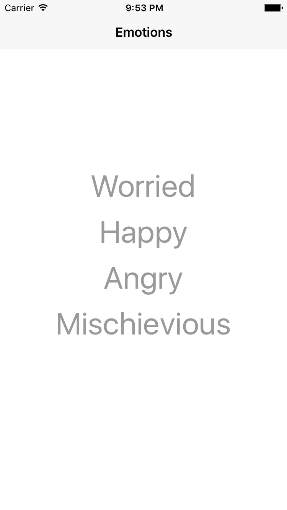
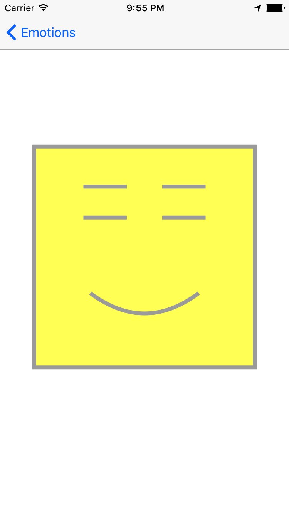
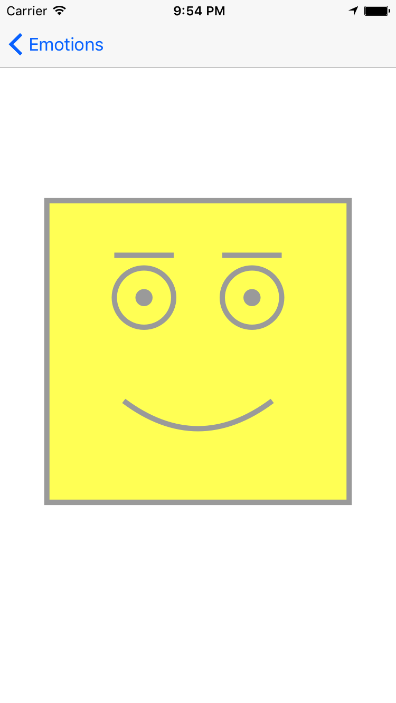
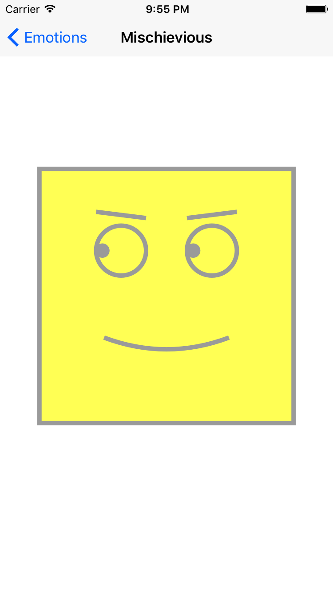

# FaceIt Demo 
FaceIt Demo from Developing iOS Apps with Swift (cs193p) modified.
- drawing a simple face that can have four emotions
- using gestures to change the smile and eyes

  
    
  
  

